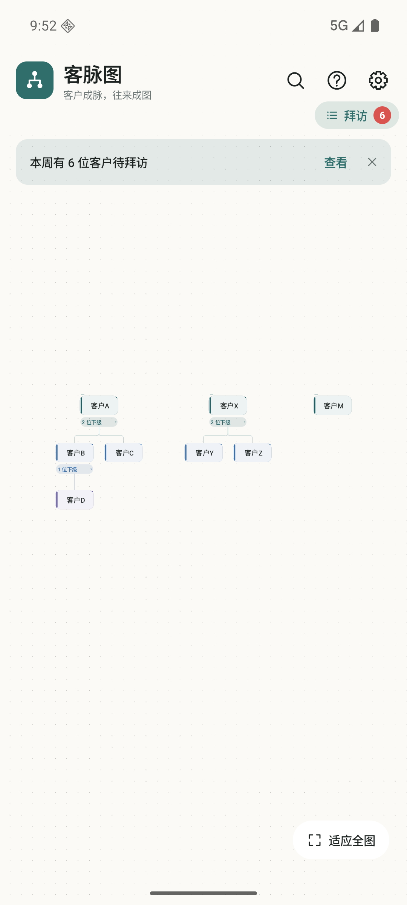
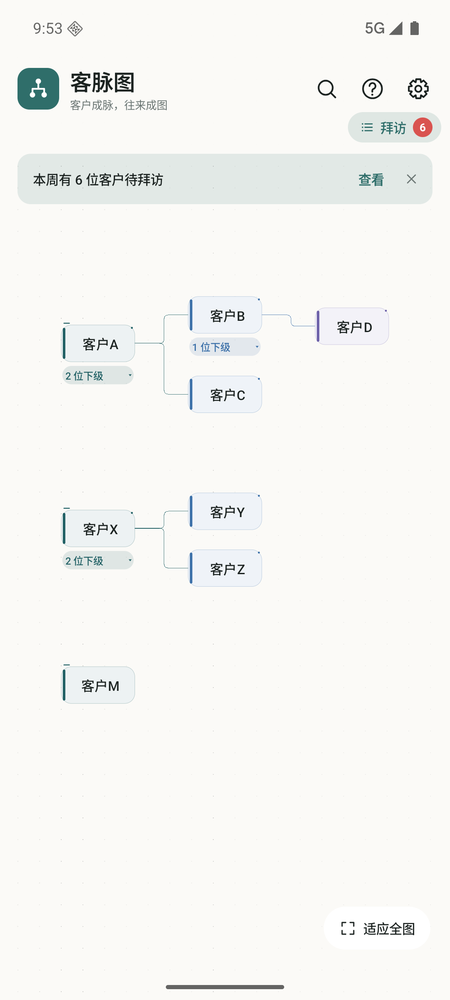
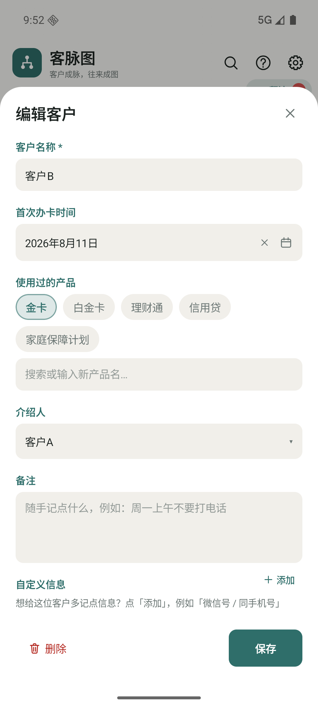
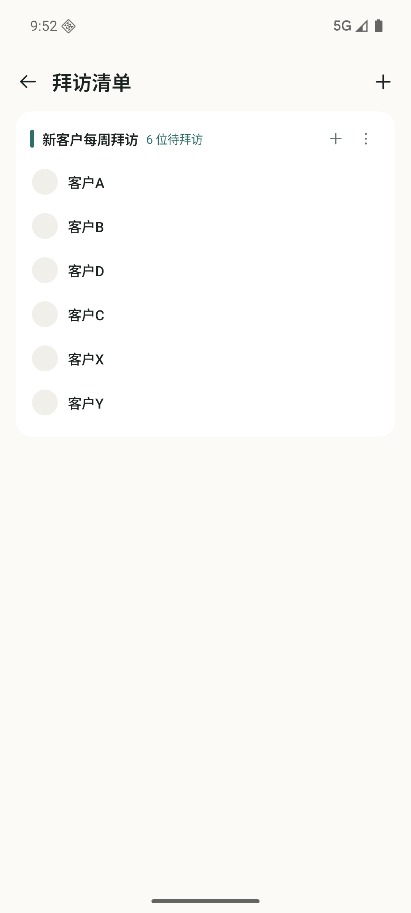
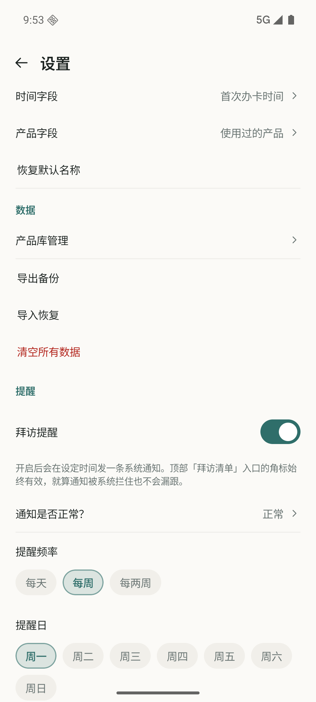
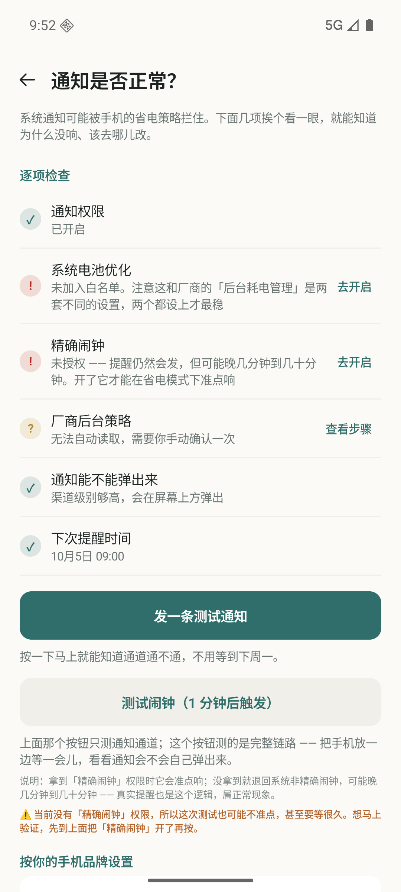
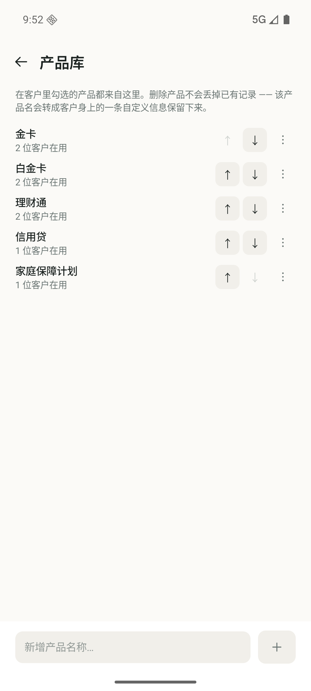
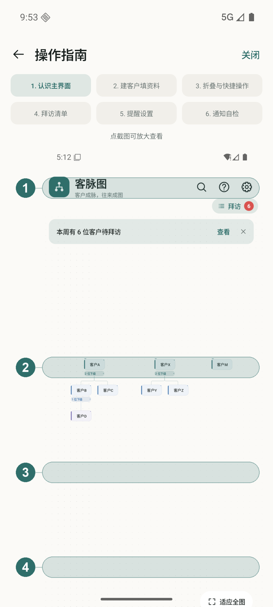

# 客脉图

> **客户成脉，往来成图**

把客户关系画成一张可以无限延展的思维导图 —— 谁介绍了谁，一眼看清；
再按办卡时间自动生成拜访清单，该跟进的一个都不漏。

Android 应用 · 纯本地存储 · **不联网、不要任何账号**

---

## 界面

| 主界面（竖向脉络） | 横向脉络 | 客户编辑 |
| :---: | :---: | :---: |
|  |  |  |

| 拜访清单 | 提醒设置 | 通知自检 |
| :---: | :---: | :---: |
|  |  |  |

| 产品库 | 操作指南 |
| :---: | :---: |
|  |  |

---

## 它解决什么问题

做销售、做客户维护的人，客户关系往往是一张**网**：A 介绍了 B，B 又带来了 C。
但大多数工具只能给你一个**列表** —— 列表看不出"这条线是谁带来的"。

客脉图把这件事画出来：

- 每位客户是图上的**一个节点**
- 谁介绍来的，就挂在谁的下方，形成层级
- 同一级的客户横向并排
- 画布**无限大**，上下左右都能一直延伸

另外还有一份**拜访清单**：按办卡时间自动算出最近该跟进的客户，每周提醒一次，
拜访完打个勾并留下记录。

---

## 功能

### 导图

| 功能 | 说明 |
| --- | --- |
| 无限画布 | 单指拖动平移，双指捏合缩放（30%~250%），右下角「适应全图」一键看全貌 |
| 竖向 / 横向脉络 | 竖向＝上级在上、下级在下；横向＝上级在左、下级在右。随时切换 |
| 卡片配色 | 两套可选：**按脉络深度**（第 1 层一色、第 2 层一色…）或**按客户家族**（同子树同色相） |
| 多个根客户 | 互不相关的客户并排，各自带一整棵子树 |
| 客户字段 | 名称、办卡时间、产品（多选）、备注、自定义信息（条数不限） |
| 字段名可改 | 三个内置字段的名字都能改成任何行业的叫法（学员 / 房源 / 会员…） |
| 介绍关系 | 加下级 / 加同级 / 改介绍人；自动拦截成环操作 |
| 产品库 | 统一维护，可增删改、排序、停用；删除产品不会丢客户数据 |
| 搜索 | 搜客户名称、产品、备注、自定义信息；点结果自动飞到该节点 |
| 折叠子树 | 点卡片下方的「n 位下级」收起整棵子树；折叠状态会保存 |
| 操作指南 | 应用内置 6 章图文指南，配图是真实界面截图 + 序号标注 |

### 拜访提醒

| 功能 | 说明 |
| --- | --- |
| 拜访入口 | 顶部「拜访 n」入口带未完成数量角标，**角标永远准确** |
| 自动清单 | 「新客户每周拜访」按办卡时间自动生成，每周一重置本周已拜访状态 |
| 自建清单 | 想建几张建几张，名字随你起 |
| 快速标记 | 点左边的圈＝用今天标记已拜访；再点一下可取消 |
| 拜访历史 | 每次标记留一条记录，条目详情里能看 |
| 三层提醒 | ① 顶部角标 ② 打开应用时的横幅 ③ 系统通知 |
| 提醒可配置 | 开关、频率（每天/每周/每两周）、提醒日、提醒时间、新客户判定（3/6/12 个月） |
| 通知自检 | 6 项检查 + 一键测试通知 + 一键测试闹钟 + 按机型品牌自动匹配厂商后台设置路径 |

---

## 安装

1. 到 [Releases](../../releases) 下载最新的 `客脉图_vX.Y.Z_debug.apk`
2. 传到手机（微信 / QQ / 数据线均可），点击安装
3. 系统提示"不允许安装未知来源应用"时，给**文件管理器**开启"允许安装未知应用"权限后继续

> **首次打开是干净的空画布**，没有任何演示数据。
> 空画布中间有个「新建第一位客户」按钮，点它开始。

### 权限说明

应用**不申请网络权限**，也不申请存储权限（导出备份用系统文件选择器）。
只有拜访提醒用到这几个，都不涉及隐私数据：

| 权限 | 用途 | 什么时候问 |
| --- | --- | --- |
| 通知 | 发拜访提醒 | Android 13+ 首次用到时问一次 |
| 开机自启 | 手机重启后恢复提醒定时 | 系统自动授予，无弹窗 |
| 精确闹钟 | 让提醒准点送达（**不强制**，不给也能用） | 需要你到系统设置里手动开，自检页有一键入口 |
| 忽略电池优化 | 加入系统 Doze 白名单，避免后台被冻结 | 自检页一键弹出系统对话框 |

**最低系统版本**：Android 8.0（API 26）

---

## 通知没响怎么办

系统通知**可能被手机的省电策略拦住** —— 小米 / 华为 / OPPO / vivo 对后台任务管控都很严，
这是已知现象，不是应用的问题。

应用里内置了 **「设置 → 提醒 → 通知是否正常？」** 自检页，把原因逐条摊开：

| 检查项 | 说明 |
| --- | --- |
| 通知权限 | 没开的话点右边直接跳去开 |
| 系统电池优化 | 是否已加入 Doze 白名单；点「去开启」直接弹出系统对话框 |
| 精确闹钟 | 是否已授权；没授权提醒仍会发，但可能晚几分钟到几十分钟 |
| 厂商后台策略 | 系统不开放读取，需要你按引导手动确认一次 |
| 通知能不能弹出来 | 通知渠道级别够不够高（只有「高」才会横幅弹出） |
| 下次提醒时间 | 让你知道闹钟到底排上没有 |

按品牌内置的引导会自动匹配你的机型：

| 品牌 | 设置路径 |
| --- | --- |
| **VIVO / iQOO** | 设置 → 电池 → 后台耗电管理 → 客脉图 → **允许后台高耗电** |
| 小米 / Redmi | 设置 → 应用设置 → 客脉图 → 省电策略 → **无限制**；并开启**自启动** |
| 华为 / 荣耀 | 设置 → 应用 → 应用启动管理 → 客脉图 → 关闭"自动管理" → 勾选**允许自启动/关联启动/后台活动** |
| OPPO / 一加 / realme | 设置 → 电池 → 应用耗电管理 → 客脉图 → 允许**后台运行** + **自动启动** |
| 三星 | 设置 → 电池 → 后台使用限制 → 把客脉图从"休眠应用"中移除 |

> **底线保证**：不管通知响不响，**顶部「拜访清单」入口的角标永远是准的**。
> 只要你打开应用，就一定能看到本周的名单，不会漏跟。

自检页还有两个测试按钮：
- **发一条测试通知** —— 立刻验证通知通道通不通
- **测试闹钟（1 分钟后触发）** —— 走完整链路，验证「闹钟 → 广播 → 通知」这一段

---

## 从源码构建

需要 JDK 17+ 和 Android SDK（compileSdk 36）。

```bash
# 构建 debug 包
./gradlew :app:assembleDebug

# 产物
app/build/outputs/apk/debug/app-debug.apk
```

Windows 下也可以用仓库里的脚本：

```bat
工具\2-构建并安装.bat
```

### 技术栈

纯 Kotlin + Jetpack Compose + Material 3，**零第三方依赖**：

| 项 | 版本 |
| --- | --- |
| Kotlin | 2.2.10 |
| Compose BOM | 2025.04.01 |
| AGP | 8.13.0 |
| Gradle | 8.14.3 |
| compileSdk / targetSdk | 36 |
| minSdk | 26（Android 8.0） |

数据存本机单个 JSON 文件（`filesDir/kemai_data.json`）；
画布用 `Canvas` + `TextMeasurer` 手绘配合视口裁剪与细节分级；
提醒用系统自带 `AlarmManager`。

### 工程结构

```
KemaiTu/app/src/main/java/com/kemai/app/
├── model/Models.kt              数据模型 + 字段名/脉络方向/配色方式/语言等枚举
├── data/                        JsonCodec + AppRepository
├── reminder/                    ReminderScheduler + ReminderReceiver + BootReceiver
├── ui/
│   ├── theme/                   配色（深度/家族两套）、字号、各类 CompositionLocal
│   ├── canvas/                  TreeLayout（竖向/横向双方向）+ CanvasScreen
│   ├── components/              通用小部件 + KemaiIcon（自绘图标入口）
│   ├── editor/ products/ search/ visits/ settings/ guide/
├── util/Dates.kt
├── KemaiApplication.kt
└── MainActivity.kt
```

---

## 版本历史

见 [CHANGELOG.md](CHANGELOG.md)。

---

## 说明

- 本项目为**个人自用**工具，暂不公开源码
- 数据全部存在手机本地，不上传任何服务器
- 应用内**没有广告、没有统计、没有网络请求**

---

*客户成脉，往来成图。*
